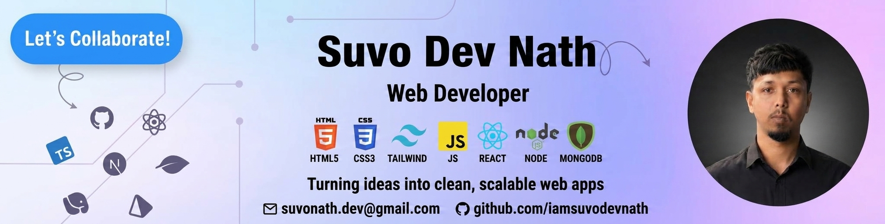

  

#👋 Hi, I'm Suvo Dev Nath

### Full-Stack Developer · React · Next.js · TypeScript · Node.js

I build **scalable, high-performance, and production-ready web applications** with modern technologies and clean, maintainable architecture.

I enjoy turning ideas into polished digital products — from responsive interfaces and complex frontend systems to robust APIs, databases, authentication, and full-stack applications.

  
  

## 🚀 About Me

* 🔭 Currently building **[Hypercampus-LMS](https://github.com/iamsuvodevnath/-Hypercampus-LMS)**
* 💻 Focused on **modern full-stack web development**
* ⚡ Experienced with **React, Next.js, TypeScript & the MERN ecosystem**
* 🧩 Interested in **scalable architecture, performance, UI/UX & developer experience**
* 🌱 Continuously learning and exploring modern web technologies
* 📂 Explore my projects → **[GitHub](https://github.com/iamsuvodevnath)**
* 📫 Email: <a href="mailto:suvonath.dev@gmail.com"><strong>suvonath.dev@gmail.com</strong></a>

## 🛠️ Tech Stack

### Frontend

  

### Backend & Database

  

### Tools & Workflow

  

## 💡 What I Build

- ▸ Modern Frontend Applications
- ▸ Full-Stack Web Applications
- ▸ REST & GraphQL APIs
- ▸ Authentication & Authorization Systems
- ▸ Responsive & Accessible Interfaces
- ▸ Scalable Database-Driven Applications
- ▸ Performance-Focused Web Experiences

## 📌 Featured Project

### 🎓 Hypercampus LMS

A modern learning management system designed to provide a complete digital learning experience.

**Focus areas:**

`Next.js` · `React` · `TypeScript` · `Node.js` · `MongoDB` · `Tailwind CSS`

🔗 **[View Project →](https://github.com/iamsuvodevnath/-Hypercampus-LMS)**

## 📊 GitHub Statistics

<!-- 

  
  

 -->

  

## 🌐 Connect With Me

  
  &nbsp;

  
  &nbsp;

  
  &nbsp;

  

